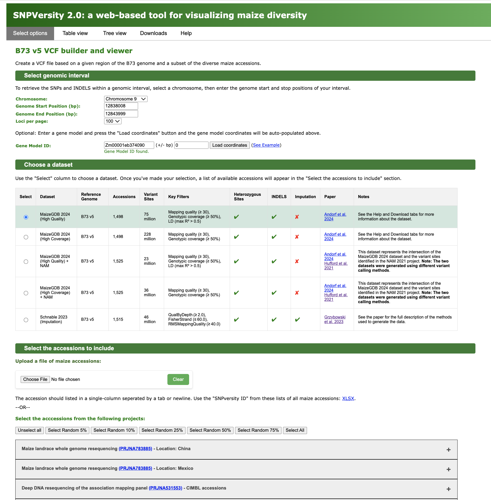

# SNPversity2.0
SNPversity2.0 is a web-based tool to display maize variant data.

## MaizeGDB instance of SNPversity 2.0

https://wgs.maizegdb.org/

## Citation

Pending.

## Browser Compatibility 

SNPVersity was developed using a JavaScript framework, ensuring that most of its functionalities operate directly within your local browser. To guarantee optimal performance and a seamless user experience, we have tested and fine-tuned the tool for compatibility with the latest versions of Google Chrome and Mozilla Firefox. However, users accessing SNPversity via Safari or other browsers might experience some performance inconsistencies. Should you encounter any issues, please do not hesitate to ask for assistance.

## SNPversity code
SNPversity uses a combination of HTML, JavaScript, and CSS for the front-end development. Two PHP files and a Python script make up the server-side application. The variant data is stored in HDF5 databases and called through Python. The gene model coordinates are stored in a service-oriented PHP array.

### Requirements
The best way to run a local version of SNPversity is to download the Docker container and HDF5 databases.  You will need a web server (e.g. Apache) that runs PHP and Python to run the source code directly. The code was developed and tested on PHP 8.2.8 and Python 3.9.12.  The Python script uses packages h5py, sys, json, and numpy.  

### SNPversity website directory structure

```bash
SNPversity/
├── css
    └── main.css
├── gff
    └── genes_data.serialized
├── gif
    └── loading.gif
├── hdf5
├── js
    ├──header_data.js
    ├──main.js
    └── VCF2PopTree.js
├── vcf
├── h5_to_vcf.py
├── index.html
├── lookupGeneModel.php
├── maize_accessions.txt
└── maize_accessions.tsv

```
### Description of code

| File                    | Description                                                                           |
|-------------------------|---------------------------------------------------------------------------------------|
|index.html | The main HTML code that provides the core framework of the website. |
|h5_to_vcf.py | Python script that queries the HDF5 database based on the genomic region and then filters the results on the selected maize accessions.|
|lookupGeneModel.php | A PHP script that returns the chromosome, start, and end positions of a given gene model in B73 RefGen_v5.|
|maize_accessions.txt and maize_accessions.tsv | A list of the accession names, GenBank SRA ID, BioProject, and the unique name used in SNPversity.|
|main.css | The main CSS file for styling the webpage.|
|genes_data.serialized | A serialized PHP array storing the coordinates of the B3 RefGen_v5 gene models.|
|main.js | The core JavaScript code used for visualization and other website functionality.|
|VCF2PopTree.js | Modified JavaScript code from the VCF2PopTree project used for drawing phylogenetic trees.|
|header_data.js | A JavaScript file containing an array of the column headers of a fulle VCF entry.|
|vcf [directory] | The directory where VCF files are stored. The VCF files are generated by the user's queries and used to build the tables and trees.  The Docker image has built-in CRON jobs to periodically clean the contents of the directory.|
|hdf5 [directory] | The directory stores the HDF5 databases for each database type (high coverage and high quality). There is a separate database for each chromosome.|


# Website usage

## Select options


**A screenshot of the 'Select options' tab.**  

The two primary inputs for this tool are selecting the genomic interval of interest and selecting which subset of maize accessions to include.

### Select genomic interval:
This section allows the user to select the genomic interval of interest. The two main options are entering the genomic coordinates or a gene model identifier.

* Genome Version: Select the reference genome version. The only option currently available is B73 version 5.
* Dataset: Select the variation dataset to query. The 'MaizeGDB High Quality' dataset was built on 1,498 diverse maize accessions and was filtered on mapping quality (>= 30), mapping coverage (>= 50%), and linkage disequilibrium with max R2 > 0.5. There were approximately 75 million annotated loci in this dataset. The 'MaizeGDB High Coverage' dataset was built on 1,498 diverse maize accessions and was filtered only on mapping quality (>= 30) and mapping coverage (>= 50%). There are approximately 230 million annotated loci in this dataset.
* Chromosome: Select the chromosome.
* Genome Start Position (bp): Select the start position on the chromosome.
* Genome End Position (bp): Select the end position on the chromosome.
* Loci per page: Select the number of loci to view per page in the HTML table view. This number corresponds to the number of rows in the table.
* Gene Model ID: Optionally, select the gene model identifier and the number of base pairs to add as padding to the start and end of the gene model coordinates. Pressing the 'Load coordinates' button will load the chromosome, start, and end positions if the gene model is found. This option currently only accepts B73 RefGen_v5 gene models.

(NOTE: Genomic regions larger than 1 MB will only be available as VCF downloads. The table and tree views will not be available.)

### Select which accessions to include:
This section allows the user to select a subset of the maize accessions to view. The two main options are to upload a file with the accession IDs, use the buttons to randomly subsample the datasets, or use the checkboxes to manually select the maize accessions. A list of all maize accessions can be found in both XLSX and TSV formats. 

## Table view


**A screenshot of the 'Table view' tab.**  

The table view option allows the user to download the VCF generated from the select options tab and displays a data table (for regions <= 1Mb). Each row of the data corresponds to a locus position in the dataset. The descriptions of the columns are in the following table.

|Column name | Definition | Abbreviation |  Example data|
|---------------|--------------|--------------|--------------| 
|Chromosome |CHR | The chromosome where the locus is located | chr1 |   
|Position |POS| The genomic coordinate on the chromosome | 104985| 
|Reference allele  | REF | The allele value for the locus in the reference genome B73. | A |
|Alternate allele  | ALT | The alternative allele value found in other maize accessions | T | 
|Gene models  | Gene model(s) | The name of the B73 RefGen_v5 gene model affected by the variant. Displays the closest gene models when the variant is "intergenic". | Zm00001eb404830 | 
|Effect type  | Effect type | The type of effect using Sequence Ontology terms. | stop gained |
|Effect impact | Effect impact | A estimation of putative impact/deleteriousness.| HIGH MODIFIER |
|Mapping quality score | MQ | The average mapping quality of reads supporting the variant.| 58 |
|Coverage Percent | COV | The percent of genotypes with at least one read at the given variant.  | GT |
|Maximum squared correlation | max R2 | The maximum R2 for a given loci.  | 0.64 |

The gene models in the Gene model(s) column are linked to the MaizeGDB B73 genome browser.  The position of the locus is shown as a vertical line on the browser.
 
For synonymous and missense variant effect types, the information in the Effect type column shows the following information in parentheses: the amino acid for the reference genome, the position, and the amino acid substitution in the alternative genome (e.g., G477S).

The remainder of the columns are based on the subset of selected maize accessions. There are columns (named based on the accession name, an underscore, and the SRR ID) for each of the ~1500 accessions in Genotype (GT) format:
* 0 (green) indicates a homozygous reference genotype.  
* 1 (orange)  indicates a homozygous alternate genotype.
* H (yellow) indicates a heterozygous genotype with one reference and one alternate allele.
* N (grey) indicates a missing or unknown genotypes.

## Tree view


**A screenshot of the 'Tree view' tab.**  

The tree view option allows the user to generate phylogenetic tree views based on the VCF2PopTree tool (https://github.com/sansubs/vcf2pop).  The input to build the tree is based on the VCF file generated from the select options tab.

The tree tree can be constructed as in the either an UPGMA tree of Neighbour-Joining tree (Unrooted).  The drawing options are inlcudes Rectangular tree or Radial tree.  In addtion the trees can be saved in the following text formats: Newick tree, Pair-wise diversity (MEGA), or PHYLIP.

# MaizeGDB 2024 Dataset
A new haplotype map  for maize was generated using a diverse set of inbred lines, landraces, and teosintes from 1,498 public resequenced lines through a standardized variant-calling pipeline against version 5 of the B73 reference genome. The output was filtered for mapping quality, coverage, and linkage disequilibrium, and annotated based on variant effects relative to the B73 RefGen_v5 gene annotations.  Two versions of the dataset are available.  A high-coverage dataset consisting of ~230 million loci was filtered on mapping quality and coverage. A high-quality dataset of ~75 million loci had an additional filtering step based on high confident linkage disequilibrium.  See tables below to see the projects used to build the dataset and a summary of the variant effect annotations.

|Accessions | Project |Project name|	
|---------------|--------------|--------------|
|539 |PRJCA009749 |WGS resequencing of 1,604 maize inbred lines	 |
|521 |PRJNA531553 |Deep DNA resequencing of the association mapping panel |	
|340 |PRJNA783885 |Maize landrace whole genome resequencing	 |
|35 |PRJEB56320 |Maize Wisconsin Diversity Panel Resequencing |	
|32 |PRJNA609577 |Zea mays Genome sequencing |	
|11 |PRJNA389800 |Whole genome sequencing of maize 282 panel |	
|8 |PRJEB14212 |European maize diversity |	
|7 |PRJNA399729 |Maize Haplotype Map version 3 |	
|6 |PRJNA260788 |Zea mays Genome sequencing (European maize genomes) |	
|1 |PRJEB56265 |Resequencing of three Polish maize inbred lines |	

The table shows the composition of public resequencing data used to build the dataset.  The table lists the number of accessions from each NCBI bioproject.

|Effect | High Coverage | High Quality |
|---------------|--------------|--------------|
|intergenic |216,128,332 |69,236,257|
|5' UTR | 544,839 | 287,968|
|synonymous |1,042,272 |523,102|
|missense |1,311,927 |572,404|
|stop |61,129  |20,049|
|frameshift |138,463 |40,550|
|intron |8,601,103 |4,349,068|
|non-coding	|3,708 |1,978|
|3'UTR |801,323 |468,603|
|other |46,355 |18,411|
|TOTAL |228,679,451 |75,518,390|

The table shows the variant effect dataset.  The table the type of variant effect for the high-coverage and high-quality datasets.


# Data Processing
This section describes the data process steps to format VCF files into a format to be used by the SNPVersity2.0 website.  Each of the scripts can be found in the /scripts/ directory.

## Step 1: Filtering
The first step strips the raw VCF of any unneeded metadata and filters each locus by mapping quality (MQ >= 30), coverage (COV >= 50%), and removing multi-allelic loci.

|Terms | Abbreviation | Definition | 
|---------------|--------------|--------------|
|Mapping Quality | MQ | The average mapping quality of reads supporting the variant. | 
|Coverage Count | CVC | The number of genotypes with at least one read at the given variant. | 
|Coverage Percent | CVP | The percent of genotypes with at least one read at the given variant. | 

The table shows the metadata saved for each vairant locus.

Filter criteria  
* MQ >= 30  
* CVP >= 50  
* Remove multiallelic variants.  

|Usage | Description | 
|---------------|--------------|
|script| filter_and_clean.py | 
|input| A unfiltered VCF file.  |
|output| A filtered VCF file with MQ and COV in the INFO field and 'GT' formated alleles.  |
|sample usage| python filter_and_clean.py chr1_unfiltered.vcf chr1_filtered.vcf|  

The table shows how to use this script.

## Step 2: Annotation
The second step requires the installation of SNPEff (https://pcingola.github.io/SnpEff/).  SNPEff is used to annotate the variant effects for each locus against a reference genome. 

|Terms | Abbreviation | Definition | 
|---------------|--------------|--------------|
|Gene model name | GENEMODEL | The name of the gene model affected by the variant. Uses the closest gene models when the variant is "intergenic”.  |
|Putative impact | EFFECT | A simple estimation of putative impact/deleteriousness: {HIGH, MODERATE, LOW, MODIFIER}.   |
|Annotation type | TYPE |  The type of effect using Sequence Ontology terms.  |
|Substitution | SUB | For synonymous and missense variant effect types, this lists the wild type amino acid, the postion, and the amino acid substiution (e.g. G477S). |

The table shows the metadata saved for each vairant locus.

|Usage | Description | 
|---------------|--------------|
|script | snpEff.jar  |
|input | The filterd VCF file from step 1. | 
|output: | A SNPEff annotated VCF file. | 
|sample usage | java -jar snpEff.jar maize chr1_filtered.vcf > chr1_snpeff.vcf |

The table shows how to use this script.


## Step 3: Filter on Linkage Disequilibrium

The third step requires the installation of PLINK (https://www.cog-genomics.org/plink/).  PLINK is used to identify linkage disequilbrium between the variant loci.

Filter criteria

* Linkage distance between 400bp to 5000bp  
* max R2 >= 0.5  

|Terms | Abbreviation | Definition | 
|---------------|--------------|--------------|
|Squared correlation | R2 | The square of the correlation coefficient between pairs of loci on a chromosome. It is a measure of the degree of association or linkage disequilibrium between the alleles at the two loci. |
|Maximum squared correlation | MAXR2 | The maximum R2 for a given loci. | 

The table shows the metadata saved for each vairant locus.

|Usage | Description | 
|---------------|--------------|
|script | plink  |
|input | The annotated VCF file from step 2. | 
|output: | A PLINK formatted dataset with the LD information (ld file) and an output file. | 
|sample usage | plink --vcf chr1_snpeff.vcf --const-fid 0 --r2 --ld-window-kb 5 --ld-window 99999 --ld-window-r2 0 --out chr1_snpeff_plink.txt |

The table shows how to use the plink script.

|Usage | Description | 
|---------------|--------------|
|script | filter_LD.py  |
|input | A PLINK formatted dataset with the LD information  (ld file). | 
|output: | A filtered PLINK formatted dataset based on linkage distance and max R2 score. | 
|sample usage | python filter_LD_fast.py chr1_snpeff_plink.txt.ld chr1_snpeff_plink_filter.txt.ld |

The table shows how to use the python script to filter the plink data.

## Step 4: Clean VCFs

|Column name | Definition | Abbreviation |  Example data|
|---------------|--------------|--------------|--------------| 
|Chromosome |CHROM | The chromosome where the locus is located | chr1 |   
|Position |POS| The genomic coordinate on the chromosome | 104985| 
|Identifier |ID| The value of the IDs are '.'| . |
|Reference allele  | REF | The allele value for the locus in the reference genome B73. | A |
|Alternate allele  | ALT | The alternative allele value found in other maize accessions | T | 
|Quality score  | QUAL | The average mapping quality of reads supporting the variant. | 738.32 |
|Filter | FILTER | The value of the FILTERs are '.'| . |
|Information | INFO | The metadata from the filtering, annotation, and LD steps are stored here.| MQ=58.01;CVC=1486;CVP=99.20 |
|Allele format | FORMAT | The value of the FORMART are in Genotype format and saved as 'GT'  | GT |

The table shows the metadata saved for each vairant locus after the cleaning step.

The following values are found in the Information field: 
* GENEMODEL (e.g. Zm00001eb430510)  
* EFFECT (e.g. HIGH, MODERATE, LOW, MODIFIER)  
* TYPE (e.g.  intergenic, synonymous_variant, missense_variant, frameshift_variant, 3_prime_UTR_variant, etc.)  
* MQ (e.g. 47.19)  
* CVC (e.g.1109)   
* CVP (e.g. 74.03)  
* MAXR2 (0.68417)  // MAXR2 is available in the high-quality dataset
* SUB (G477S) 

There are also columns (named based on the accession name, an undercore, and the SRR ID) for each of the ~1500 accessions in Genotype (GT) format:  
* 0/0 indicates a homozygous reference genotype.  
* 0/1 or 1/0 indicates a heterozygous genotype with one reference and one alternate allele.
*  1/1 indicates a homozygous alternate genotype.  
* ./. missing or unknown genotypes.

|Usage | Description | 
|---------------|--------------|
|script | final_filter_clean_LD.py  |
|input | The annotated VCF file from step 2 and the filtered PLINK formatted dataset from step 3.   | 
|output: | The final annotated VCF file with LD information. | 
|sample usage | python final_filter_clean_plink.py chr1_snpeff_plink_filter.txt.ld chr1_snpeff.vcf chr1_LD_final.vcf  |

The table shows how to use the script to filter the high-quality dataset (includes output from PLINK).

|Usage | Description | 
|---------------|--------------|
|script | final_filter_clean.py  |
|input | The annotated VCF file from step 2. | 
|output: | The final annotated VCF file without LD information.  | 
|sample usage | python final_filter_clean.py chr1_snpeff.vcf chr1_final.vcf |

The table shows how to use the script to filter the high-coverage dataset (no LD information).


## Step 5: Summary and Statistics

Get a summary and statistics of the final VCF datasets.   

Gene model summary includes counts of the following types of annotations: total, intergenic, upstream, 5' UTR, synonymous, missense, stop, frameshift, intron, non_coding, 3' UTR, downstream, and other.

Statistics include:  
* Total number of SNPs/INDELS  
* Count of homozygous alleles  
* Count of heterozygous alleles  
* Count of missing alleles  
* Number of SNPs with at least one heterozygous allele  
* Count of Deletions  
* Count of Insertions  
* Count of loci with Mapping Quality with (30 <= MQ < 40)	 
* Count of loci with Mapping Quality with (40 <= MQ < 50)	 
* Count of loci with Mapping Quality with (50 <= MQ < 60)	  
* Count of loci with Coverage Percentage with (50 <= CVP < 60)  
* Count of loci with Coverage Percentage with (60 <= CVP < 70)  
* Count of loci with Coverage Percentage with (70 <= CVP < 80)  
* Count of loci with Coverage Percentage with (80 <= CVP < 90)  
* Count of loci with Coverage Percentage with (90 <= CVP <= 100)  
* Count of loci with max R2 with (50 <= MAXR2 < 60)	
* Count of loci with max R2 with (60 <= MAXR2 < 70)		
* Count of loci with max R2 with (70 <= MAXR2 < 80)		
* Count of loci with max R2 with (80 <= MAXR2 < 90)	  	
* Count of loci with max R2 with (90 <= MAXR2 <= 100)

|Usage | Description | 
|---------------|--------------|
|script | get_stats.py OR get_stats_LD.py |
|input | The final filterd and cleaned cersion of the VCF file from step 4. | 
|output: | A final text file with the final summary and statistics. | 
|sample usage | python get_stats.py chr1_LD_final.vcf > chr1_stats.txt |

The table shows how to use this script.

## Step 6: Convert datasets to HDF5 databases

The final step is to convert the VCF files for each chromosome into HDF5 databases.  There is a custom Python program that will read in the VCF and generate the HDF5 databases.  For the general use cases used in SNPVersity, searching small genomic regions, we chunk the data in 100kb chunks to improve querying performance.  This value can be adjusted. The HDF5 databases allow the data to be quickly searched by genomic region and filtered by a subset of maize accessions.  

|Usage | Description | 
|---------------|--------------|
|script | convert_HDF5.py  |
|input | The filterd VCF file from step 1 and the chunk size. | 
|output: | A SNPEff annotated VCF file. | 
|sample usage | python convert_HDF5.py  chr1_LD_final.vcf chr1_high_quality.h5 100000 OR python convert_HDF5.py  chr1_final.vcf chr1_high_coverage.h5 100000|

The table shows how to use this script.

## Optional: Prepare data for PanEffect

This optional step will create linkage files between SNPversity and the PanEffect tool (https://github.com/Maize-Genetics-and-Genomics-Database/PanEffect). PanEffect is a JavaScript framework to explore variant effects across a reference genome or pangenome. The step requires the CSV files from PanEffect that scores all possible missense mutations on how likely it will have a functional effect.  The CSV file is modified to flag any missense mutation that occurs in the given VCF file.  The updated file can be used in PanEffect to toggle between all possbile missense mutations and the naturally occurring variation found in a VCF file.  The two scripts are below.

|Usage | Description | 
|---------------|--------------|
|script | get_missense_mutations.py  |
|input | The annotated VCF file from step 2. | 
|output: | A TSV file listing all the missense mutations in the VCF file. | 
|sample usage | python get_missense_mutations.py chr1_snpeff.vcf chr1_missense.txt|

The table shows how to use the first script that exacts all the missense mutations from the VCF file.

|Usage | Description | 
|---------------|--------------|
|script | WGS_to_paneffect.py  |
|input | A TSV file listing all the missense mutations in the VCF file and a directory with a CSV file for each gene model from PanEffect. | 
|output: | A directory where the updated CSV files for each gene model will be stored.  | 
|sample usage | python WGS_to_paneffect.py chr1_missense.txt ./csv/ ./csv_wgs/ |

The table shows how to use the second script that updates the CSV files for each gene model generated in PanEffect.


